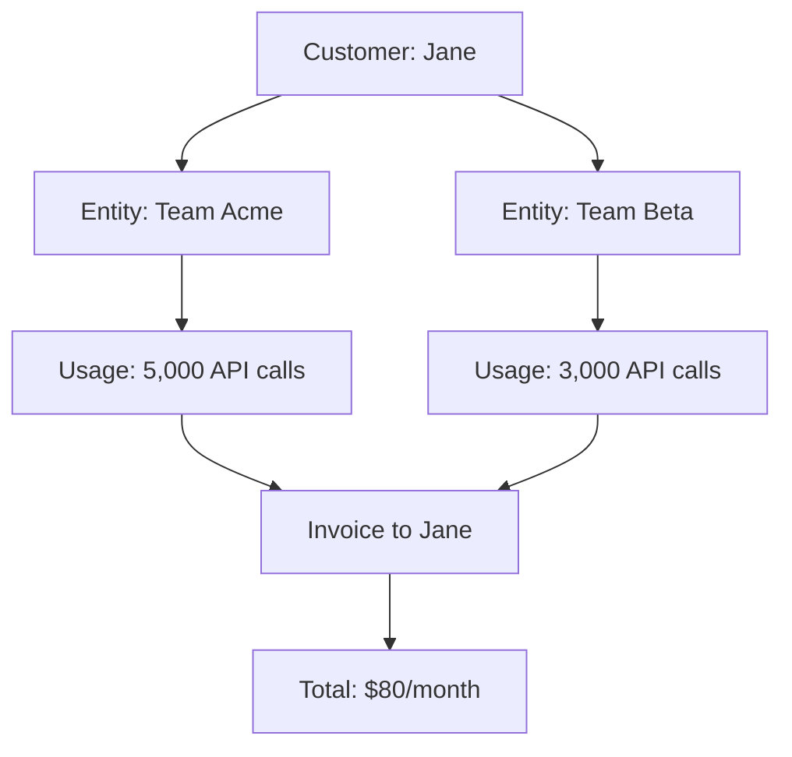

## Overview

**Entities** enable multi-tenant usage tracking and billing within Autumn. They represent sub-accounts, teams, workspaces, or projects that belong to a customer. Each entity:

- Has independent usage tracking and limits
- Can have its own subscriptions
- Rolls up billing to the parent customer
- Provides isolation between tenants

Entities are perfect for B2B SaaS applications where a single customer (user) manages multiple teams or organizations.

## Entity Structure

Every entity has these core attributes:

<ParamField path="id" type="string" required>
  Unique identifier for the entity within the customer's scope (e.g., `team_acme`, `workspace_123`)
</ParamField>

<ParamField path="customer_id" type="string" required>
  ID of the parent customer who owns this entity
</ParamField>

<ParamField path="name" type="string">
  Human-readable name for the entity (e.g., "Acme Corp Team")
</ParamField>

<ParamField path="feature_id" type="string">
  Optional feature ID that this entity is associated with
</ParamField>

<ParamField path="created_at" type="number">
  Unix timestamp when entity was created
</ParamField>

<ParamField path="deleted" type="boolean" default="false">
  Whether the entity has been soft-deleted
</ParamField>

<ParamField path="env" type="string">
  Environment identifier (e.g., `production`, `development`)
</ParamField>

## Why Use Entities?

### Without Entities

A single customer has one set of limits shared across all their usage:

```typescript Traditional Approach
// User "jane" has 10,000 API calls total
await autumn.track({
  customer_id: "jane",
  event_name: "api_call"
});

// All usage counts against jane's single pool
```

**Problem**: No way to separate usage between different teams or projects.

### With Entities

Each entity has its own limits and tracking:

```typescript Entity-Based Approach
// Team Acme has 10,000 API calls
await autumn.track({
  customer_id: "jane",
  entity_id: "team_acme",
  event_name: "api_call"
});

// Team Beta has separate 10,000 API calls
await autumn.track({
  customer_id: "jane",
  entity_id: "team_beta",
  event_name: "api_call"
});
```

**Benefit**: Jane can manage multiple teams, each with independent usage and limits.

## Use Cases

### Team-Based SaaS

User manages multiple teams:

```typescript Example: Slack-like Structure
// Jane is the customer
await autumn.customers.create({
  id: "jane_123",
  email: "jane@example.com"
});

// She creates two team entities
await autumn.entities.create({
  customer_id: "jane_123",
  id: "team_acme",
  name: "Acme Corp"
});

await autumn.entities.create({
  customer_id: "jane_123",
  id: "team_startup",
  name: "My Startup"
});

// Each team subscribes to a plan
await autumn.attach({
  customer_id: "jane_123",
  entity_id: "team_acme",
  product_id: "team-pro"
});

await autumn.attach({
  customer_id: "jane_123",
  entity_id: "team_startup",
  product_id: "team-starter"
});
```

### Project-Based Billing

Track usage per project:

```typescript Example: Development Platform
// Customer has multiple projects
await autumn.entities.create({
  customer_id: "dev_456",
  id: "project_website",
  name: "Company Website"
});

await autumn.entities.create({
  customer_id: "dev_456",
  id: "project_app",
  name: "Mobile App"
});

// Track deployment events per project
await autumn.track({
  customer_id: "dev_456",
  entity_id: "project_website",
  event_name: "deployment"
});
```

### Workspace Isolation

Separate resources by workspace:

```typescript Example: Design Tool
// Personal workspace
await autumn.entities.create({
  customer_id: "designer_789",
  id: "workspace_personal",
  name: "Personal Projects"
});

// Client workspace
await autumn.entities.create({
  customer_id: "designer_789",
  id: "workspace_client_a",
  name: "Client A Projects"
});

// Storage usage tracked separately
await autumn.track({
  customer_id: "designer_789",
  entity_id: "workspace_personal",
  event_name: "storage_used",
  properties: { gigabytes: 5 }
});
```

## Entity Subscriptions

Entities can have their own subscriptions (products):

```typescript Example: Entity Subscriptions
// Attach product to entity
await autumn.attach({
  customer_id: "user_123",
  entity_id: "team_acme",
  product_id: "team-pro"
});

// Entity gets its own entitlements
const { allowed, balance } = await autumn.check({
  customer_id: "user_123",
  entity_id: "team_acme",
  feature_id: "api-calls"
});

console.log(balance);
// {
//   balance: 10000,
//   used: 1523,
//   limit: 10000,
//   unlimited: false
// }
```

<Info>
Each entity subscription creates separate customer entitlements scoped to that entity.
</Info>

## Usage Tracking

Track usage at the entity level:

```typescript Example: Entity Usage Tracking
// Track API call for team_acme
await autumn.track({
  customer_id: "user_123",
  entity_id: "team_acme",
  event_name: "api_call",
  properties: {
    endpoint: "/users",
    method: "GET"
  }
});

// Track storage for team_beta (separate)
await autumn.track({
  customer_id: "user_123",
  entity_id: "team_beta",
  event_name: "storage_used",
  properties: {
    gigabytes: 15
  }
});
```

### Checking Entity Limits

Verify entity-specific entitlements:

```typescript Example: Check Entity Access
const { allowed, balance } = await autumn.check({
  customer_id: "user_123",
  entity_id: "team_acme",
  feature_id: "api-calls"
});

if (!allowed) {
  throw new Error("Team has exceeded API limit");
}

// Process request for team_acme
await handleTeamApiRequest(teamId);
```

## Billing Flow

Entity usage rolls up to the parent customer for billing:



### How It Works

1. **Entity subscribes**: Entity gets its own subscription
2. **Usage occurs**: Events tracked per entity
3. **Billing aggregates**: All entity charges combine
4. **Customer pays**: Parent customer receives consolidated invoice

```typescript Example: Multi-Entity Billing
// Team Acme subscription: $50/month
await autumn.attach({
  customer_id: "jane",
  entity_id: "team_acme",
  product_id: "team-pro"  // $50/month
});

// Team Beta subscription: $30/month
await autumn.attach({
  customer_id: "jane",
  entity_id: "team_beta",
  product_id: "team-starter"  // $30/month
});

// Jane receives one invoice for $80/month
// Itemized:
// - Team Acme Pro: $50
// - Team Beta Starter: $30
```

## Entity Feature Association

Entities can be linked to specific features:

<ParamField path="feature_id" type="string">
  Associates entity with a feature for special tracking or limits
</ParamField>

```typescript Example: Feature-Linked Entities
// Create entity linked to seats feature
await autumn.entities.create({
  customer_id: "org_123",
  id: "workspace_main",
  name: "Main Workspace",
  feature_id: "workspace-seats"
});

// Track seat usage for this workspace
await autumn.track({
  customer_id: "org_123",
  entity_id: "workspace_main",
  event_name: "seat_added"
});
```

<Note>
This is useful when entities themselves represent consumable resources (e.g., each workspace counts as 1 unit).
</Note>

## Retrieving Entities

Fetch entities for a customer:

```typescript Example: List Customer Entities
const entities = await autumn.entities.list({
  customer_id: "user_123"
});

console.log(entities);
// [
//   { id: "team_acme", name: "Acme Corp", ... },
//   { id: "team_beta", name: "Beta Inc", ... }
// ]
```

### Get Single Entity

```typescript Example: Get Entity Details
const entity = await autumn.entities.get({
  customer_id: "user_123",
  entity_id: "team_acme"
});

console.log(entity);
// {
//   id: "team_acme",
//   customer_id: "user_123",
//   name: "Acme Corp",
//   created_at: 1704067200
// }
```

## Updating Entities

Modify entity properties:

```typescript Example: Update Entity
await autumn.entities.update({
  customer_id: "user_123",
  entity_id: "team_acme",
  name: "Acme Corporation"
});
```

## Deleting Entities

Entities are soft-deleted by default:

```typescript Example: Delete Entity
await autumn.entities.delete({
  customer_id: "user_123",
  entity_id: "team_acme"
});
```

<Warning>
Deleting an entity:
- Marks entity as `deleted: true`
- Cancels all entity subscriptions
- Preserves historical usage data
- Cannot be undone
</Warning>

## Entity Uniqueness

Entities are unique by:

**Organization + Environment + Customer + ID**

```typescript Uniqueness Examples
// ✅ Valid: Same entity ID, different customers
{ customer_id: "user_123", id: "team_acme" }
{ customer_id: "user_456", id: "team_acme" }

// ✅ Valid: Same customer, different entity IDs
{ customer_id: "user_123", id: "team_acme" }
{ customer_id: "user_123", id: "team_beta" }

// ❌ Invalid: Duplicate entity for same customer
{ customer_id: "user_123", id: "team_acme" }
{ customer_id: "user_123", id: "team_acme" }
```

## Environment Isolation

Entities are environment-specific:

```typescript Example: Environment Separation
// Development entity
await autumn.entities.create({
  customer_id: "user_123",
  id: "team_acme",
  name: "Test Team"
}, { env: "development" });

// Production entity (separate)
await autumn.entities.create({
  customer_id: "user_123",
  id: "team_acme",
  name: "Acme Corp"
}, { env: "production" });
```

## Common Patterns

### Multi-Team Application

```typescript Slack-Style Teams
// User creates account
const user = await autumn.customers.create({
  id: "user_jane",
  email: "jane@example.com"
});

// User creates first team
const teamAcme = await autumn.entities.create({
  customer_id: "user_jane",
  id: "team_acme",
  name: "Acme Corp"
});

// Subscribe team to plan
await autumn.attach({
  customer_id: "user_jane",
  entity_id: "team_acme",
  product_id: "team-pro"
});

// User joins another team (different owner)
await autumn.track({
  customer_id: "user_john",  // John owns this team
  entity_id: "team_startup",
  event_name: "member_added",
  properties: {
    member_id: "user_jane"
  }
});
```

### Project-Based Billing

```typescript Platform with Projects
// Customer has multiple projects
const projects = [
  { id: "proj_website", name: "Website" },
  { id: "proj_api", name: "API Service" },
  { id: "proj_mobile", name: "Mobile App" }
];

for (const project of projects) {
  await autumn.entities.create({
    customer_id: "dev_123",
    id: project.id,
    name: project.name
  });
  
  // Each project gets base allocation
  await autumn.attach({
    customer_id: "dev_123",
    entity_id: project.id,
    product_id: "project-base"
  });
}

// Track per-project usage
await autumn.track({
  customer_id: "dev_123",
  entity_id: "proj_website",
  event_name: "build_minutes",
  properties: { minutes: 45 }
});
```

### Workspace-Based Limits

```typescript Design Tool Workspaces
// Personal workspace - free tier
await autumn.entities.create({
  customer_id: "designer_123",
  id: "ws_personal",
  name: "Personal Workspace"
});

await autumn.attach({
  customer_id: "designer_123",
  entity_id: "ws_personal",
  product_id: "free"  // 5 GB storage
});

// Professional workspace - paid tier
await autumn.entities.create({
  customer_id: "designer_123",
  id: "ws_agency",
  name: "Agency Workspace"
});

await autumn.attach({
  customer_id: "designer_123",
  entity_id: "ws_agency",
  product_id: "pro"  // 100 GB storage
});

// Check workspace storage limit
const { allowed } = await autumn.check({
  customer_id: "designer_123",
  entity_id: "ws_agency",
  feature_id: "storage-gb"
});
```

## Frequently Asked Questions

<AccordionGroup>
  <Accordion title="When should I use entities vs separate customers?">
    **Use entities when**:
    - Single user manages multiple teams/projects
    - You want consolidated billing
    - Teams share a payment method
    - User switches between teams frequently
    
    **Use separate customers when**:
    - Independent organizations with separate billing
    - Different payment methods required
    - No shared user account
    - Complete data isolation needed
  </Accordion>

  <Accordion title="Can entities have different products/plans?">
    Yes! Each entity can subscribe to different products:
    ```typescript
    // Team A on Pro plan
    await autumn.attach({
      customer_id: "user_123",
      entity_id: "team_a",
      product_id: "pro"
    });
    
    // Team B on Starter plan
    await autumn.attach({
      customer_id: "user_123",
      entity_id: "team_b",
      product_id: "starter"
    });
    ```
    Both charges appear on the customer's invoice.
  </Accordion>

  <Accordion title="How do I prevent one entity from affecting another's limits?">
    Entities have completely isolated usage tracking. Limits are enforced per-entity:
    
    ```typescript
    // Team A hits limit
    const teamA = await autumn.check({
      customer_id: "user_123",
      entity_id: "team_a",
      feature_id: "api-calls"
    });
    // { allowed: false }
    
    // Team B still has quota
    const teamB = await autumn.check({
      customer_id: "user_123",
      entity_id: "team_b",
      feature_id: "api-calls"
    });
    // { allowed: true, balance: 5000 }
    ```
  </Accordion>

  <Accordion title="Can I track usage without entity_id?">
    Yes! Customer-level usage (without entity_id) is tracked separately:
    
    ```typescript
    // Customer-level usage
    await autumn.track({
      customer_id: "user_123",
      event_name: "api_call"
    });
    
    // Entity-level usage
    await autumn.track({
      customer_id: "user_123",
      entity_id: "team_acme",
      event_name: "api_call"
    });
    ```
    
    These are tracked independently and have separate limits.
  </Accordion>

  <Accordion title="What happens to entity data when customer is deleted?">
    When a customer is deleted:
    1. All their entities are deleted (cascade)
    2. All entity subscriptions are canceled
    3. Historical usage data is preserved
    4. Entities cannot be recovered
    
    This is a destructive operation and cannot be undone.
  </Accordion>

  <Accordion title="Can I move an entity from one customer to another?">
    Not directly. To transfer entity ownership:
    1. Create new entity under target customer
    2. Recreate subscriptions on new entity
    3. Migrate relevant data in your application
    4. Delete old entity
    
    Historical usage data cannot be transferred.
  </Accordion>
</AccordionGroup>

## Related Resources

<CardGroup cols={2}>
  <Card title="Customers" icon="users" href="/concepts/customers">
    Learn about customer structure
  </Card>
  <Card title="Create Entity" icon="plus" href="/api/entities/create">
    Create entities via API
  </Card>
  <Card title="Track Usage" icon="chart-line" href="/api/billing/track">
    Track entity-scoped usage
  </Card>
  <Card title="Check Access" icon="shield-check" href="/api/billing/check">
    Verify entity entitlements
  </Card>
</CardGroup>