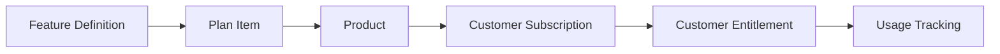

## Overview

**Features** are the building blocks for usage-based billing and access control in Autumn. They represent measurable capabilities or resources that customers consume, such as:

- API calls
- Storage capacity
- Seats or users
- Credits or tokens
- Custom metered events

Features enable you to track usage, enforce limits, and bill customers based on their consumption.

## Feature Types

Autumn supports different feature types for various use cases:

### Metered Features

Metered features track continuous usage with automatic aggregation:

```json Example: API Call Feature
{
  "id": "api-calls",
  "name": "API Calls",
  "type": "metered",
  "consumable": true,
  "event_names": ["api_call"],
  "display": {
    "singular": "API Call",
    "plural": "API Calls"
  }
}
```

<Info>
Metered features automatically track events from your application. Usage is aggregated in real-time and can be checked via the `/check` endpoint.
</Info>

### Boolean Features

Boolean features represent on/off access control:

```json Example: Advanced Analytics Access
{
  "id": "advanced-analytics",
  "name": "Advanced Analytics",
  "type": "boolean",
  "consumable": false
}
```

<Note>
Boolean features don't track usage quantities—they simply grant or deny access.
</Note>

### Credit System Features

Credit features act as a universal currency that can be spent across multiple metered features:

```json Example: Platform Credits
{
  "id": "credits",
  "name": "Platform Credits",
  "type": "credit_system",
  "consumable": true,
  "credit_schema": [
    {
      "metered_feature_id": "api-calls",
      "credit_cost": 1
    },
    {
      "metered_feature_id": "storage-gb",
      "credit_cost": 100
    },
    {
      "metered_feature_id": "compute-hours",
      "credit_cost": 50
    }
  ]
}
```

<Note>
Credit systems allow customers to allocate their balance flexibly across different resources. In this example:
- 1 API call costs 1 credit
- 1 GB storage costs 100 credits
- 1 compute hour costs 50 credits
</Note>

## Feature Schema

All features share these core attributes:

<ParamField path="id" type="string" required>
  Unique identifier for the feature (e.g., `api-calls`, `storage-gb`)
</ParamField>

<ParamField path="name" type="string" required>
  Human-readable name displayed to customers
</ParamField>

<ParamField path="type" type="string" required>
  Feature type: `metered`, `boolean`, or `credit_system`
</ParamField>

<ParamField path="consumable" type="boolean" required>
  Whether the feature tracks consumable usage:
  - `true` for metered features and credit systems
  - `false` for boolean features
</ParamField>

<ParamField path="event_names" type="array">
  Array of event names that trigger this feature's usage tracking
</ParamField>

<ParamField path="credit_schema" type="array">
  For credit system features: defines conversion rates to metered features
  
  <Expandable title="Credit Schema Item">
    <ParamField path="metered_feature_id" type="string">
      ID of the metered feature this credit can be spent on
    </ParamField>
    <ParamField path="credit_cost" type="number">
      How many credits are deducted per unit of the metered feature
    </ParamField>
  </Expandable>
</ParamField>

<ParamField path="display" type="object">
  Display settings for the feature
  
  <Expandable title="properties">
    <ParamField path="singular" type="string">
      Singular form (e.g., "API Call")
    </ParamField>
    <ParamField path="plural" type="string">
      Plural form (e.g., "API Calls")
    </ParamField>
  </Expandable>
</ParamField>

<ParamField path="archived" type="boolean" default="false">
  Whether the feature is archived
</ParamField>

## Consumable vs Non-Consumable

The `consumable` flag determines how features behave:

### Consumable Features

- Track usage that depletes a balance
- Customers have a quota that decreases with usage
- Examples: API calls, storage, compute hours
- Type: `metered` or `credit_system`

```typescript Usage Pattern
// Check balance before use
const { allowed, balance } = await autumn.check({
  customer_id: "user_123",
  feature_id: "api-calls"
});

if (!allowed) {
  throw new Error("API limit exceeded");
}

// Perform action
await processApiRequest();

// Track usage
await autumn.track({
  customer_id: "user_123",
  event_name: "api_call"
});
```

### Non-Consumable Features

- Grant access without tracking consumption
- Simple yes/no entitlement check
- Examples: Feature flags, access tiers
- Type: `boolean`

```typescript Usage Pattern
const { allowed } = await autumn.check({
  customer_id: "user_123",
  feature_id: "advanced-analytics"
});

if (allowed) {
  // Show advanced analytics dashboard
}
```

## Display Configuration

Customize how features appear to customers:

```json Example: Display Names
{
  "id": "api-calls",
  "name": "API Calls",
  "display": {
    "singular": "API Call",
    "plural": "API Calls"
  }
}
```

This enables proper pluralization in UI:
- "You have used 1 **API Call**"
- "You have used 100 **API Calls**"
- "You have 5,000 **API Calls** remaining"

## Event Tracking

Features automatically track usage when you send events via the Track API:

```typescript Example: Track API Call
await autumn.track({
  customer_id: "user_123",
  event_name: "api_call",
  properties: {
    endpoint: "/users",
    method: "GET",
    response_time: 145
  }
});
```

### Event Names

Specify which event names trigger the feature:

<ParamField path="event_names" type="array">
  Event names that contribute to this feature's usage
</ParamField>

```json Example: Multiple Event Names
{
  "id": "api-calls",
  "name": "API Calls",
  "event_names": ["api_call", "api_request", "endpoint_hit"]
}
```

<Info>
Any event with a name in this array will increment the feature's usage counter.
</Info>

## Credit System Configuration

Credit systems define conversion rates from credits to metered features:

<ParamField path="credit_schema" type="array" required>
  Array of credit conversion rules
  
  <Expandable title="Credit Schema Item">
    <ParamField path="metered_feature_id" type="string">
      ID of the metered feature this credit can be spent on
    </ParamField>
    <ParamField path="credit_cost" type="number">
      How many credits are deducted per unit of the metered feature
    </ParamField>
  </Expandable>
</ParamField>

```json Example: Flexible Credit Schema
{
  "id": "credits",
  "name": "Platform Credits",
  "type": "credit_system",
  "consumable": true,
  "credit_schema": [
    {
      "metered_feature_id": "api-calls",
      "credit_cost": 1
    },
    {
      "metered_feature_id": "storage-gb",
      "credit_cost": 100
    },
    {
      "metered_feature_id": "video-minutes",
      "credit_cost": 50
    }
  ]
}
```

### How Credit Systems Work

1. **Customer receives credits** via product entitlement
2. **Customer uses metered feature** (e.g., makes API call)
3. **Credits are deducted** based on credit_cost (1 credit per API call)
4. **Balance decreases** until replenished or reset

```typescript Example: Credit System Flow
// Customer has 10,000 credits
// Makes 1 API call (costs 1 credit)
await autumn.track({
  customer_id: "user_123",
  event_name: "api_call"
});
// Balance: 9,999 credits

// Uses 5 GB storage (costs 500 credits)
await autumn.track({
  customer_id: "user_123",
  event_name: "storage_used",
  properties: { gigabytes: 5 }
});
// Balance: 9,499 credits
```

## Features and Entitlements

Features are connected to products through **plan items**, which become **customer entitlements** when a customer subscribes:



### The Flow

1. **Define feature**: Create a feature (e.g., `api-calls`)
2. **Add to product**: Include feature in a plan item with allowance
3. **Customer subscribes**: Customer attaches to the product
4. **Entitlement created**: Customer gets a customer_entitlement with balance
5. **Track usage**: Events decrement the balance

```json Example: Feature → Entitlement
// 1. Feature
{
  "id": "api-calls",
  "name": "API Calls",
  "type": "metered"
}

// 2. Plan Item (in Product)
{
  "feature_id": "api-calls",
  "included": 10000,
  "reset": { "interval": "month" }
}

// 3. Customer Entitlement (after subscription)
{
  "feature_id": "api-calls",
  "balance": 10000,
  "used": 0,
  "unlimited": false,
  "interval": "month",
  "next_reset_at": 1735689600
}
```

See [Products and Plans](/concepts/products-and-plans) for details on plan items and entitlements.

## Environment Separation

Features are environment-specific. This allows you to test features in development without affecting production:

<Warning>
Events sent to the `development` environment will only increment usage for development features.
</Warning>

```typescript Example: Environment Isolation
// Development feature
await autumn.features.create({
  id: "api-calls",
  name: "API Calls (Dev)",
  type: "metered"
}, { env: "development" });

// Production feature (separate)
await autumn.features.create({
  id: "api-calls",
  name: "API Calls",
  type: "metered"
}, { env: "production" });
```

## Archiving Features

Archive features instead of deleting them:

<ParamField path="archived" type="boolean" default="false">
  Whether the feature is archived
</ParamField>

Archived features:
- Stop accepting new usage events
- Preserve historical usage data
- Remain attached to existing customer entitlements
- Don't appear in product configuration UI

```typescript Archive Feature
await autumn.features.update({
  feature_id: "old-api-calls",
  archived: true
});
```

## Entity-Scoped Features

Features can be tracked at the entity level for multi-tenant scenarios:

```typescript Example: Team-Scoped Storage
await autumn.track({
  customer_id: "user_123",
  entity_id: "team_acme",
  event_name: "storage_used",
  properties: {
    gigabytes: 10
  }
});

// Check entity-specific balance
const { balance } = await autumn.check({
  customer_id: "user_123",
  entity_id: "team_acme",
  feature_id: "storage-gb"
});
```

See [Entities](/concepts/entities) for multi-tenant usage tracking patterns.

## Common Patterns

### API Rate Limiting

```json Feature Definition
{
  "id": "api-calls",
  "name": "API Calls",
  "type": "metered",
  "consumable": true,
  "event_names": ["api_call"],
  "display": {
    "singular": "API Call",
    "plural": "API Calls"
  }
}
```

```typescript Usage Enforcement
app.use(async (req, res, next) => {
  const { allowed } = await autumn.check({
    customer_id: req.user.id,
    feature_id: "api-calls"
  });

  if (!allowed) {
    return res.status(429).json({
      error: "Rate limit exceeded"
    });
  }

  next();
});
```

### Storage Tracking

```json Feature Definition
{
  "id": "storage-gb",
  "name": "Storage",
  "type": "metered",
  "consumable": true,
  "event_names": ["storage_measured"],
  "display": {
    "singular": "GB",
    "plural": "GB"
  }
}
```

```typescript Periodic Measurement
// Run daily to measure current storage
const currentStorageGB = await calculateStorageUsage(customerId);

await autumn.track({
  customer_id: customerId,
  event_name: "storage_measured",
  properties: {
    gigabytes: currentStorageGB
  }
});
```

### Seat Management

```json Feature Definition
{
  "id": "team-seats",
  "name": "Team Seats",
  "type": "metered",
  "consumable": true,
  "display": {
    "singular": "Seat",
    "plural": "Seats"
  }
}
```

```typescript Seat Tracking
// When adding team member
const { allowed } = await autumn.check({
  customer_id: orgId,
  feature_id: "team-seats"
});

if (!allowed) {
  throw new Error("No available seats");
}

await addTeamMember(orgId, userId);

await autumn.track({
  customer_id: orgId,
  event_name: "seat_used",
  properties: { user_id: userId }
});
```

### Flexible Credit System

```json Feature Definition
{
  "id": "credits",
  "name": "Platform Credits",
  "type": "credit_system",
  "consumable": true,
  "credit_schema": [
    {
      "metered_feature_id": "api-calls",
      "credit_cost": 1
    },
    {
      "metered_feature_id": "ai-generations",
      "credit_cost": 10
    },
    {
      "metered_feature_id": "video-transcodes",
      "credit_cost": 50
    }
  ]
}
```

```typescript Credit Usage
// Customer has 1,000 credits
// Can choose to spend on:
// - 1,000 API calls (1 credit each)
// - 100 AI generations (10 credits each)
// - 20 video transcodes (50 credits each)
// - Or any combination
```

## Frequently Asked Questions

<AccordionGroup>
  <Accordion title="Can I change a feature's configuration after it's created?">
    Yes, but be cautious:
    - Changing `event_names` affects which events count going forward
    - Historical usage data remains unchanged
    - Existing customer entitlements are not automatically updated
    - Consider creating a new feature for major changes
  </Accordion>

  <Accordion title="What's the difference between metered and credit_system features?">
    **Metered features**: Track specific usage types (API calls, storage, etc.)
    
    **Credit features**: Universal currency that converts to metered features
    
    Use credits when you want customers to allocate a balance flexibly across multiple resource types.
  </Accordion>

  <Accordion title="Can a single event increment multiple features?">
    Yes! An event can match multiple features if it appears in their `event_names` arrays:
    ```typescript
    await autumn.track({
      customer_id: "user_123",
      event_name: "api_call",
      properties: {
        endpoint: "/premium/feature"
      }
    });
    ```
    This could increment both `api-calls` and `premium-api-calls` features if both include `api_call` in their event_names.
  </Accordion>

  <Accordion title="How do I implement soft limits vs hard limits?">
    Features track usage, but enforcement is up to your application:
    
    **Soft limit** (warning):
    ```typescript
    const { allowed, balance } = await autumn.check({
      customer_id: "user_123",
      feature_id: "api-calls"
    });
    
    if (balance.usage > balance.limit * 0.9) {
      // Show warning at 90%
      console.warn("Approaching API limit");
    }
    ```
    
    **Hard limit** (block):
    ```typescript
    if (!allowed) {
      throw new Error("Usage limit exceeded");
    }
    ```
  </Accordion>

  <Accordion title="What happens to boolean features when customers upgrade?">
    Boolean features are granted/revoked based on the product's plan items:
    - If new product includes the feature → customer gets access
    - If new product excludes the feature → customer loses access
    
    No usage tracking or balances are involved with boolean features.
  </Accordion>

  <Accordion title="Can I track events retroactively?">
    Yes, you can send historical events with custom timestamps:
    ```typescript
    await autumn.track({
      customer_id: "user_123",
      event_name: "api_call",
      timestamp: 1672531200000, // Jan 1, 2023
      properties: { ... }
    });
    ```
    
    However, this won't affect past billing cycles that have already been invoiced.
  </Accordion>
</AccordionGroup>

## Related Resources

<CardGroup cols={2}>
  <Card title="Track Usage" icon="chart-line" href="/api/billing/track">
    Send usage events to increment features
  </Card>
  <Card title="Check Access" icon="shield-check" href="/api/billing/check">
    Verify feature access and limits
  </Card>
  <Card title="Products and Plans" icon="box" href="/concepts/products-and-plans">
    Connect features to products
  </Card>
  <Card title="Entities" icon="sitemap" href="/concepts/entities">
    Multi-tenant feature tracking
  </Card>
</CardGroup>