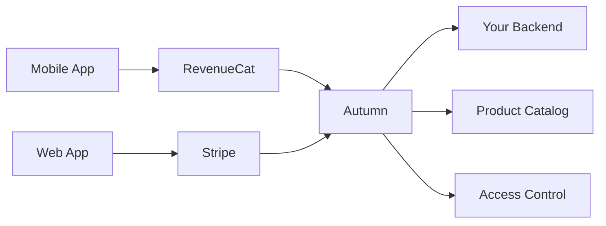

## Overview

Autumn supports multiple payment providers beyond Stripe, allowing you to handle payments from web apps, mobile apps, and alternative payment platforms. This multi-provider architecture enables you to:

- **Accept mobile payments** - Integrate with RevenueCat for iOS and Android in-app purchases
- **Expand globally** - Support regional payment providers preferred by your customers
- **Reduce dependency** - Avoid vendor lock-in with a single payment processor
- **Unify billing logic** - Manage subscriptions across all providers from one system

Autumn acts as the source of truth for your billing logic, while payment providers handle payment processing and collection.

## Supported Providers

<CardGroup cols={2}>
  <Card title="Stripe" icon="stripe" href="/integration/stripe-setup">
    Web payments, checkout flows, and subscription management
  </Card>
  <Card title="RevenueCat" icon="mobile" href="/integration/payment-providers/revenue-cat">
    iOS and Android in-app purchases with cross-platform support
  </Card>
</CardGroup>

## How Multi-Provider Support Works

### Architecture

Autumn uses a unified architecture to handle payments from different providers:



1. **Product Catalog** - Define products, features, and pricing in Autumn
2. **Provider Mapping** - Map provider-specific product IDs to Autumn products
3. **Webhook Processing** - Receive events from providers via webhooks
4. **Unified State** - Autumn maintains a single source of truth for subscriptions
5. **Access Control** - Check customer access using Autumn's `/check` endpoint

### Product Mapping

Each provider uses its own product identifiers. Autumn maps these to your internal product catalog:

<CodeGroup>
```typescript RevenueCat Mapping
// RevenueCat product ID: "com.yourapp.pro.monthly"
// Maps to Autumn product: "pro_plan"

const mapping = {
  autumn_product_id: "pro_plan",
  revenuecat_product_ids: [
    "com.yourapp.pro.monthly",
    "com.yourapp.pro.yearly"
  ]
};
```

```typescript Stripe Mapping
// Stripe uses Autumn product IDs directly
// No additional mapping required

const product = {
  id: "pro_plan",
  name: "Pro Plan",
  stripe_product_id: "prod_abc123" // Auto-synced
};
```
</CodeGroup>

### Customer Management

Customers can have subscriptions from different providers, but cannot mix them:

<Warning>
  A customer can only have active subscriptions from **one payment provider at a time**. Attempting to attach a product from a different provider will fail if the customer has active subscriptions elsewhere.
</Warning>

```typescript
// Customer with RevenueCat subscription
{
  id: "customer_123",
  processor_type: "revenuecat",
  customer_products: [
    {
      product_id: "pro_plan",
      status: "active",
      processor: { type: "revenuecat" }
    }
  ]
}

// Cannot attach Stripe product to this customer
// Must cancel RevenueCat subscription first
```

## Webhook Integration

All providers send webhook events to Autumn when subscriptions change:

### Webhook URL Format

```bash
# RevenueCat
https://your-autumn-instance.com/webhooks/revenuecat/:orgId/:env

# Stripe
https://your-autumn-instance.com/webhooks/stripe/:orgId/:env
```

### Common Events

All providers generate similar subscription lifecycle events:

| Event Type | RevenueCat | Stripe | Description |
|------------|------------|--------|-------------|
| **Initial Purchase** | `INITIAL_PURCHASE` | `customer.subscription.created` | Customer starts subscription |
| **Renewal** | `RENEWAL` | `customer.subscription.updated` | Subscription renewed successfully |
| **Cancellation** | `CANCELLATION` | `customer.subscription.deleted` | Customer canceled subscription |
| **Expiration** | `EXPIRATION` | `customer.subscription.deleted` | Subscription expired |
| **Billing Issue** | `BILLING_ISSUE` | `invoice.payment_failed` | Payment method declined |

Autumn normalizes these events internally to maintain consistent subscription states.

## Configuration

### Dashboard Setup

Configure payment providers in your Autumn dashboard:

<Steps>
  <Step title="Navigate to Settings">
    Go to **Settings** → **Payment Providers** in your Autumn dashboard.
  </Step>

  <Step title="Select Provider">
    Choose the provider you want to configure (Stripe, RevenueCat, etc.).
  </Step>

  <Step title="Add Credentials">
    Enter your provider credentials:
    - API keys (production and sandbox)
    - Webhook secrets
    - Project IDs (provider-specific)
  </Step>

  <Step title="Configure Webhooks">
    Copy the webhook URL from Autumn and add it to your provider dashboard.
  </Step>

  <Step title="Map Products">
    Create mappings between provider product IDs and Autumn products.
  </Step>
</Steps>

### Environment Variables

For self-hosted instances, configure providers via environment variables:

```bash .env
# RevenueCat Configuration
REVENUECAT_PROJECT_ID=proj_abc123
REVENUECAT_API_KEY=sk_revenuecat_...
REVENUECAT_WEBHOOK_SECRET=whsec_...

# Sandbox environment
REVENUECAT_SANDBOX_PROJECT_ID=proj_sandbox_xyz
REVENUECAT_SANDBOX_API_KEY=sk_revenuecat_test_...
REVENUECAT_SANDBOX_WEBHOOK_SECRET=whsec_test_...
```

## Access Control

Regardless of payment provider, use the same `/check` endpoint to verify customer access:

```typescript
import Autumn from 'autumn-js';

const autumn = new Autumn({
  secretKey: process.env.AUTUMN_SECRET_KEY
});

// Works for all providers
const { data } = await autumn.check({
  customerId: 'user_123',
  featureId: 'api_calls'
});

if (!data.allowed) {
  throw new Error('Access denied');
}
```

Autumn abstracts away the payment provider, giving you a consistent API regardless of how the customer pays.

## Provider Selection Strategy

### When to Use Stripe

<Card title="Best for Web Applications" icon="globe">
  - Standard subscription billing
  - Credit card payments
  - International customers (200+ countries)
  - Complex pricing models
  - Invoicing and receipts
  - Billing portal access
</Card>

### When to Use RevenueCat

<Card title="Best for Mobile Applications" icon="mobile">
  - iOS App Store subscriptions
  - Google Play Store subscriptions
  - Cross-platform mobile apps
  - In-app purchase compliance
  - StoreKit and Google Play Billing
  - Family sharing support
</Card>

## Migration Between Providers

To migrate a customer from one provider to another:

<Steps>
  <Step title="Cancel Current Subscription">
    Cancel the customer's subscription with their current provider:

    ```typescript
    await autumn.cancel({
      customerId: 'customer_123',
      productId: 'pro_plan'
    });
    ```
  </Step>

  <Step title="Wait for Expiration">
    Wait for the subscription to expire and the `customer.product.deleted` webhook to fire.
  </Step>

  <Step title="Attach New Provider">
    Subscribe the customer using the new provider:

    ```typescript
    // Mobile app subscribes via RevenueCat
    // Or web app subscribes via Stripe
    await autumn.attach({
      customerId: 'customer_123',
      productId: 'pro_plan',
      successUrl: 'https://yourapp.com/success'
    });
    ```
  </Step>
</Steps>

<Warning>
  Do not attempt to have active subscriptions from multiple providers simultaneously. This will cause conflicts in access control.
</Warning>

## Testing

### Sandbox Environments

All providers support sandbox/test environments:

```typescript
// Autumn automatically routes to sandbox provider
// when using sandbox environment

const autumn = new Autumn({
  secretKey: process.env.AUTUMN_SECRET_KEY,
  environment: 'sandbox' // Uses sandbox providers
});
```

### Test Webhooks

Test webhook integration for each provider:

<Tabs>
  <Tab title="RevenueCat">
    RevenueCat provides a webhook tester in their dashboard:

    1. Go to RevenueCat Dashboard → Project Settings → Integrations
    2. Find your Autumn webhook
    3. Click "Send Test Event"
    4. Select event type (e.g., `INITIAL_PURCHASE`)
    5. Verify webhook is received in Autumn logs
  </Tab>

  <Tab title="Stripe">
    Use Stripe CLI to test webhooks locally:

    ```bash
    # Install Stripe CLI
    brew install stripe/stripe-cli/stripe

    # Forward webhooks to local server
    stripe listen --forward-to localhost:3000/webhooks/stripe/org_123/sandbox

    # Trigger test event
    stripe trigger customer.subscription.created
    ```
  </Tab>
</Tabs>

## Monitoring

### Provider Health

Monitor webhook delivery and API health for each provider:

```typescript
// Check webhook delivery status
GET /admin/webhooks/status

{
  "revenuecat": {
    "last_webhook": "2026-02-17T12:00:00Z",
    "success_rate": 99.8,
    "failed_deliveries": 2
  },
  "stripe": {
    "last_webhook": "2026-02-17T12:05:00Z",
    "success_rate": 100,
    "failed_deliveries": 0
  }
}
```

### Analytics

View subscription metrics by provider in the Autumn dashboard:

- Revenue by provider
- Active subscriptions per provider
- Churn rate by provider
- Payment failure rates

## Best Practices

<AccordionGroup>
  <Accordion title="Define Products in Autumn First">
    Always create products in Autumn before mapping them to provider products. This ensures your billing logic is provider-agnostic.

    ```typescript
    // 1. Create Autumn product
    const product = await autumn.products.create({
      id: 'pro_plan',
      name: 'Pro Plan',
      prices: [{ amount: 2900, interval: 'month' }]
    });

    // 2. Map to provider products
    // RevenueCat: com.yourapp.pro.monthly
    // Stripe: Auto-synced
    ```
  </Accordion>

  <Accordion title="Use Consistent Product IDs">
    Keep product IDs consistent across providers to simplify your code:

    ```typescript
    // Good: Same feature check works for all providers
    await autumn.check({
      customerId: 'user_123',
      featureId: 'api_calls'
    });

    // Bad: Different feature IDs per provider
    // Requires branching logic
    ```
  </Accordion>

  <Accordion title="Handle Provider-Specific Errors">
    Different providers have different error scenarios:

    ```typescript
    try {
      await autumn.attach({ customerId, productId });
    } catch (error) {
      if (error.code === 'processor_mismatch') {
        // Customer has subscription from different provider
        // Show migration flow
      } else if (error.code === 'payment_failed') {
        // Payment method issue
      }
    }
    ```
  </Accordion>

  <Accordion title="Test Provider Failover">
    Have a plan if a provider goes down:

    - Cache customer entitlements for short periods
    - Monitor provider health endpoints
    - Have backup authentication logic
    - Communicate status to customers
  </Accordion>
</AccordionGroup>

## Next Steps

<CardGroup cols={2}>
  <Card title="RevenueCat Integration" icon="mobile" href="/integration/payment-providers/revenue-cat">
    Set up mobile app subscriptions with RevenueCat
  </Card>
  <Card title="Stripe Setup" icon="stripe" href="/integration/stripe-setup">
    Configure Stripe for web payments
  </Card>
  <Card title="Webhooks Guide" icon="webhook" href="/guides/webhooks">
    Handle webhook events from all providers
  </Card>
  <Card title="Products Concept" icon="box" href="/concepts/products-and-plans">
    Learn about Autumn's product model
  </Card>
</CardGroup>
