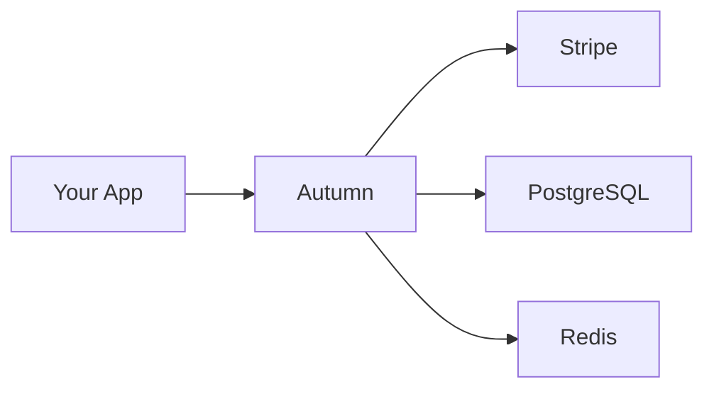

## What is Autumn?

Autumn is an open-source layer between Stripe and your application that lets you create **any pricing model** and embed it with just a few lines of code. Build subscriptions, credit systems, usage-based billing, or custom enterprise plans—without handling webhooks, upgrades, downgrades, or payment failures.

<CardGroup cols={2}>
  <Card
    title="Cloud-Hosted"
    icon="cloud"
    href="https://app.useautumn.com"
  >
    Get started instantly with our managed service
  </Card>
  <Card
    title="Self-Hosted"
    icon="server"
    href="/self-hosting"
  >
    Deploy Autumn on your own infrastructure
  </Card>
</CardGroup>

## Why Autumn?

<CardGroup cols={3}>
  <Card title="Decoupled Logic" icon="layer-group">
    Keep billing separate from app logic. Iterate on pricing without code changes or database migrations.
  </Card>
  <Card title="Any Pricing Model" icon="dollar-sign">
    Subscriptions, credits, usage-based, seat-based, hybrid models—all supported out of the box.
  </Card>
  <Card title="Simple API" icon="code">
    Just three functions: attach, check, and track. That's all you need for complete billing.
  </Card>
</CardGroup>

## Quick Example

All your billing logic can be implemented through just 3 functions:

<CodeGroup>
```tsx React
import { useAutumn } from "autumn-js/react";

const { attach } = useAutumn();

// Handle any purchase flow
<button onClick={() => attach({ productId: "pro" })}>
  Upgrade to Pro
</button>

const { check } = useAutumn();

// Check access to features
const { data } = await check({ featureId: "ai_tokens" });
if (!data.allowed) alert("AI limit reached");

const { track } = useAutumn();

// Track usage events
await track({ featureId: "ai_tokens", value: 1312 });
```

```typescript Node.js
import { Autumn } from "autumn-js";

const autumn = new Autumn({
  apiKey: process.env.AUTUMN_API_KEY,
});

// Handle any purchase flow
const result = await autumn.attach({
  customerId: "user_123",
  productId: "pro",
});

// Check access to features
const { allowed } = await autumn.check({
  customerId: "user_123",
  featureId: "ai_tokens",
});

// Track usage events
await autumn.track({
  customerId: "user_123",
  featureId: "ai_tokens",
  value: 1312,
});
```
</CodeGroup>

## Supported Pricing Models

<AccordionGroup>
  <Accordion title="Usage & Overage" icon="bolt">
    Set real-time usage limits with automatic reset intervals. Charge users when they exceed their allowance.
  </Accordion>

  <Accordion title="Credits" icon="coins">
    Users access monetary or arbitrary credits that multiple features can draw from. Perfect for API platforms.
  </Accordion>

  <Accordion title="Seat-Based" icon="users">
    Bill customers for their users or other entities, with optional per-seat limits.
  </Accordion>

  <Accordion title="Pay Upfront" icon="credit-card">
    Let users purchase a fixed quantity of a feature upfront, which depletes over time.
  </Accordion>

  <Accordion title="Subscriptions" icon="calendar-days">
    Classic recurring billing with monthly or annual intervals, with or without trial periods.
  </Accordion>
</AccordionGroup>

## Get Started

<CardGroup cols={2}>
  <Card
    title="Quickstart"
    icon="rocket"
    href="/quickstart"
  >
    Get up and running in under 5 minutes
  </Card>
  <Card
    title="Core Concepts"
    icon="book"
    href="/concepts/products-and-plans"
  >
    Understand products, features, and customers
  </Card>
  <Card
    title="API Reference"
    icon="code"
    href="/api-reference/introduction"
  >
    Explore the complete API documentation
  </Card>
  <Card
    title="SDK Documentation"
    icon="puzzle-piece"
    href="/sdks/overview"
  >
    TypeScript, React, and more
  </Card>
</CardGroup>

## Architecture Overview

Autumn sits between your application and Stripe, abstracting away the complexity of billing:



<Steps>
  <Step title="Define Products">
    Create products and plans in the dashboard with features and pricing.
  </Step>
  <Step title="Integrate SDK">
    Add the Autumn SDK to your app with `attach`, `check`, and `track`.
  </Step>
  <Step title="Handle Purchases">
    Users purchase products through Stripe Checkout—Autumn handles everything.
  </Step>
  <Step title="Check Access">
    Gate features based on what users have purchased or their usage limits.
  </Step>
</Steps>

## Community & Support

<CardGroup cols={3}>
  <Card title="Discord" icon="discord" href="https://discord.gg/53emPtY9tA">
    Join our community for help and updates
  </Card>
  <Card title="GitHub" icon="github" href="https://github.com/useautumn/autumn">
    Contribute or report issues
  </Card>
  <Card title="Email" icon="envelope" href="mailto:hey@useautumn.com">
    Get in touch with the team
  </Card>
</CardGroup>

<Note>
  **Y Combinator F24** — Autumn is backed by Y Combinator and built for growing companies that need flexible billing infrastructure.
</Note>